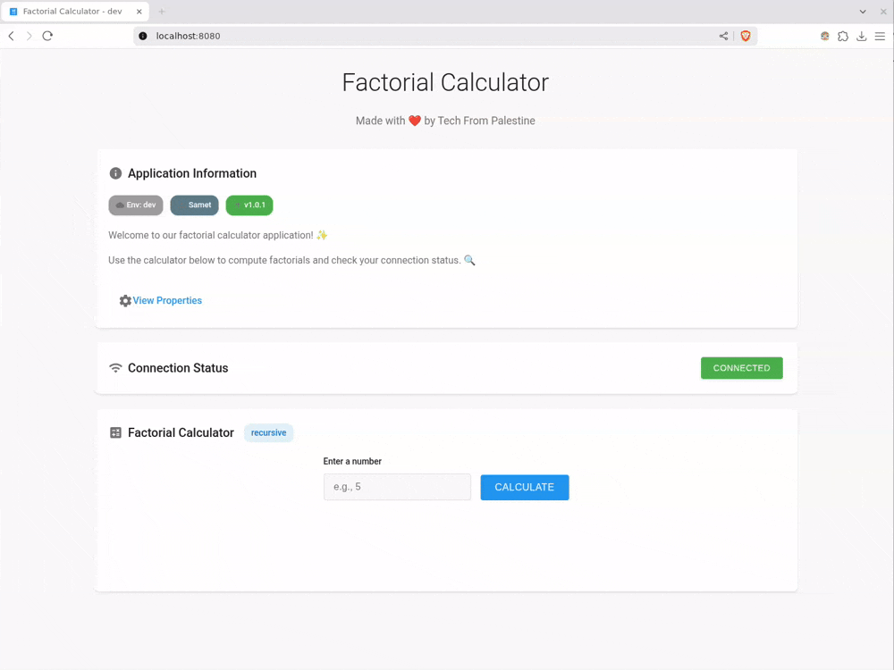

# Factorial Calculator

A Spring Boot application that performs factorial calculations with response time tracking and environment-specific configurations. The application includes token validation for secure access and provides real-time performance metrics.



## Sequence diagram


## Configuration

| Property | Description | Default | Env Variable | Example |
|----------|-------------|---------|--------------|---------|
| `app.name` | Application name | - | `APP_NAME` | `Factorial Calculator` |
| `app.env` | Current environment | `dev` | `APP_ENV` | `dev`, `tst`, `acc`, `prod` |
| `app.author` | Application author | - | `APP_AUTHOR` | `John Doe` |
| `app.version` | Application version | - | `APP_VERSION` | `1.0.0` |
| `app.resources.cpu` | CPU resources for response time | `1` | `APP_RESOURCES_CPU` | `2`, `4`, `8` |
| `app.env.tokens.dev` | Dev environment token | - | - | `dev-token-123` |
| `app.env.tokens.tst` | Test environment token | - | - | `test-token-456` |
| `app.env.tokens.acc` | Acceptance environment token | - | - | `acc-token-789` |
| `app.env.tokens.prod` | Production environment token | - | - | `prod-token-012` |


## Running Tests

```bash
# Run all tests
mvn test

# Run integration tests
mvn verify

# Run specific test
mvn test -Dtest=TokenConfigTest
```

## Features

- Fast factorial calculations (up to 20!)
- Response time tracking and performance metrics
- Environment-specific configurations
- Secure access with token validation
- Memory-optimized (200MB limit)

## Requirements

- Java 17 or higher
- Maven 3.6 or higher
- Spring Boot 3.x

## Building and Running

```bash
# Build
mvn clean package

# Run
java -Xmx200m -Xms200m -jar target/tokenvalidator-0.0.1-SNAPSHOT.jar
# or
mvn spring-boot:run
```

Note: Environment variables take precedence over properties file values.

## Project Structure

- `src/main/java/com/example/tokenvalidator/`
  - `config/TokenConfig.java` - Token configuration and validation logic
  - `controller/TokenController.java` - Web controller for token validation
  - `TokenValidatorApplication.java` - Main application class
- `src/main/resources/`
  - `application.properties` - Application configuration
  - `templates/index.html` - Web interface
- `src/test/` - Unit tests
6cs
   - Environment status

## License

This project is licensed under the MIT License. 